# 📊 Data Transformer – Advanced MySQL Project

## 🧾 Project Overview
**Data Transformer** is an advanced SQL project focused on transforming and analyzing structured data using MySQL.  
This project simulates a **Corporate Data Analysis System** involving customers, orders, and employees.

It demonstrates how raw data can be processed into meaningful insights using SQL concepts.

---

## 🎯 Objectives
- Understand SQL Joins (INNER, LEFT, RIGHT, FULL)
- Use Subqueries for filtering data
- Apply Date and String functions
- Perform calculations using Window functions
- Use CASE expressions for decision-making
- Transform data for reporting and analysis

---

# 🗄️ Database Structure

## 1. Customers Table
**Fields:**
- CustomerID  
- FirstName  
- LastName  
- Email  
- RegistrationDate  

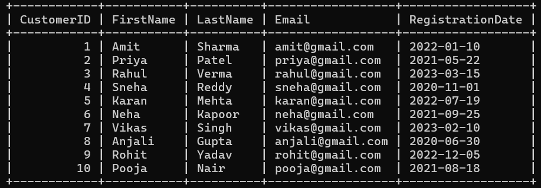

---

## 2. Orders Table
**Fields:**
- OrderID  
- CustomerID  
- OrderDate  
- TotalAmount  

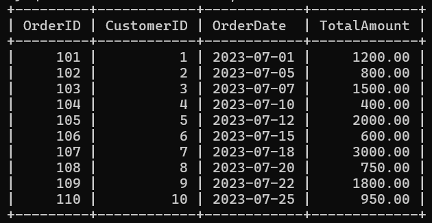

---

## 3. Employees Table
**Fields:**
- EmployeeID  
- FirstName  
- LastName  
- Department  
- HireDate  
- Salary  

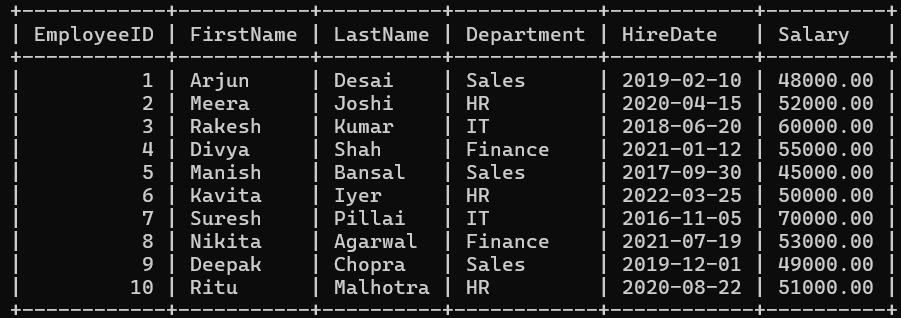

---

# 🔗 Queries & Explanation

---

## 🔹 1. INNER JOIN
**Task:** Retrieve all orders along with customer details.  
**Explanation:** Displays only matching records from both tables where a customer has placed an order.

.png)

---

## 🔹 2. LEFT JOIN
**Task:** Retrieve all customers and their orders.  
**Explanation:** Displays all customers, even if they have not placed any orders.

.png)

---

## 🔹 3. RIGHT JOIN
**Task:** Retrieve all orders with corresponding customers.  
**Explanation:** Displays all orders, even if customer details are missing.

.png)

---

## 🔹 4. FULL OUTER JOIN
**Task:** Retrieve all customers and all orders.  
**Explanation:** Combines results of both LEFT and RIGHT joins to include all records.

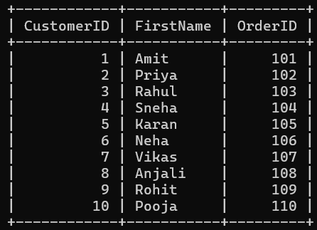

---

## 🔹 5. Customers with Above Average Spending
**Task:** Find customers whose total spending is above average.  
**Explanation:** Uses aggregation and comparison to identify high-value customers.

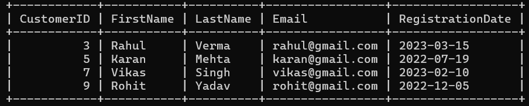

---

## 🔹 6. Employees Above Average Salary
**Task:** Find employees earning above average salary.  
**Explanation:** Compares each employee’s salary with the average salary.

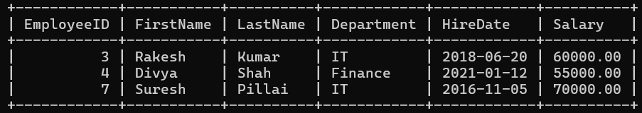

---

## 🔹 7. Extract Year and Month
**Task:** Extract year and month from order date.  
**Explanation:** Breaks down date into components for better analysis.

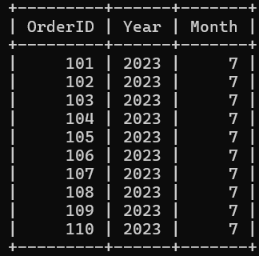

---

## 🔹 8. Date Difference
**Task:** Calculate difference between order date and current date.  
**Explanation:** Shows how many days have passed since each order.

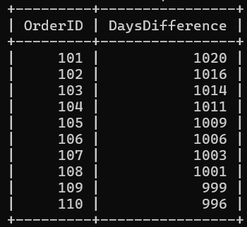

---

## 🔹 9. Format Date
**Task:** Convert date into readable format.  
**Explanation:** Improves readability of date values.

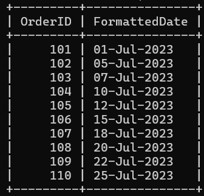

---

## 🔹 10. Full Name Creation
**Task:** Combine first and last name.  
**Explanation:** Creates a complete name for better presentation.

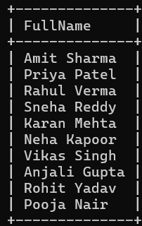

---

## 🔹 11. String Replacement
**Task:** Replace part of a string.  
**Explanation:** Demonstrates how to modify text data.

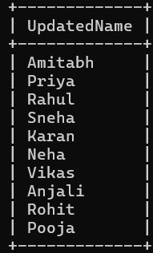

---

## 🔹 12. Upper & Lower Case
**Task:** Convert text to uppercase and lowercase.  
**Explanation:** Standardizes text formatting.

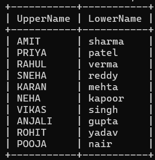

---

## 🔹 13. Trim Spaces
**Task:** Remove extra spaces.  
**Explanation:** Cleans unwanted whitespace from data.

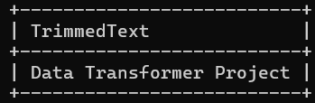

---

## 🔹 14. Running Total
**Task:** Calculate cumulative total of orders.  
**Explanation:** Uses window function to track running totals.

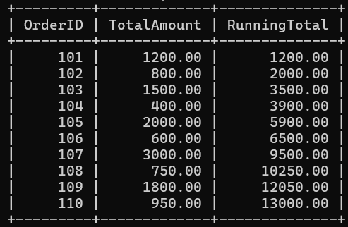

---

## 🔹 15. Rank Orders
**Task:** Rank orders based on amount.  
**Explanation:** Assigns rank to each order by value.

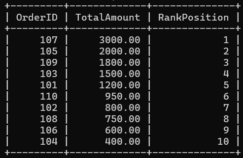

---

## 🔹 16. Discount Calculation
**Task:** Apply discount based on order amount.  
**Explanation:** Uses conditional logic to categorize discounts.

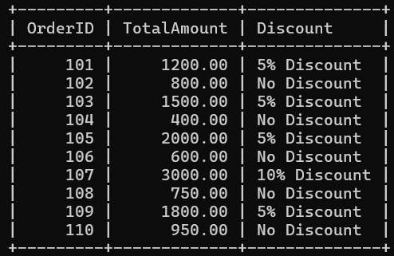

---

## 🔹 17. Salary Categorization
**Task:** Categorize employee salaries.  
**Explanation:** Classifies salaries into High, Medium, and Low.

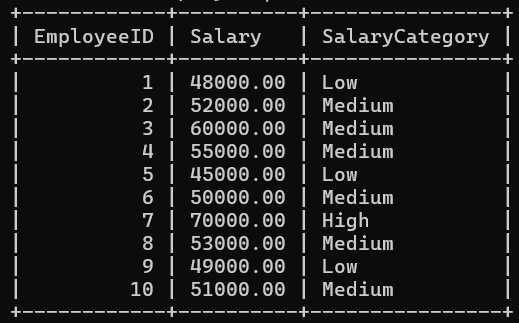

---

# ⚙️ Key Concepts Used
- SQL Joins  
- Subqueries  
- Aggregate Functions  
- Date Functions  
- String Functions  
- Window Functions  
- CASE Statements  

---

# 🎯 Conclusion
This project demonstrates the power of SQL in transforming and analyzing data.  
It provides strong practical knowledge of handling real-world data scenarios using MySQL.

---

# 📌 Author
Dhrukesh kanani

---

✨ *Bring on your coding attitude* ✨
